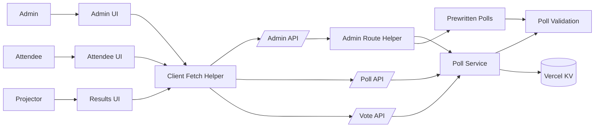
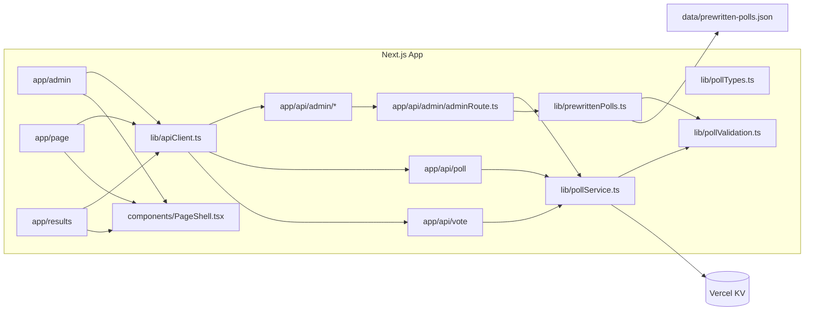

# Architecture

## 1. System Overview
- Purpose: Real-time live polling for meetups, with separate attendee, admin, and projector-style results views.
- Primary goals: low-latency state updates, simple admin control, anonymous voting, and clear aggregated results.
- Success criteria: attendees can vote and see live aggregates; admins can open/close/clear polls and load presets; results view shows active poll + history.
- Non-goals: user accounts, long-term analytics, complex moderation, or persistent user identity.

## 2. Architectural Style
- Style: Layered Next.js App Router with vertical slices (UI routes + API routes + domain services).
- Fit: UI and API live in the same codebase; simple domain logic centralized in `lib/` keeps duplication low while preserving straightforward routing.

## 3. Domain Model and Modules
- Poll domain (`lib/pollTypes.ts`, `lib/pollService.ts`): defines poll types, aggregates votes, manages active poll and history.
- Poll validation (`lib/pollValidation.ts`): shared poll type/options normalization used by poll service and prewritten poll parsing.
- Poll validation (`lib/pollValidation.ts`): shared poll type/options normalization used by poll service and prewritten poll parsing.
- Client API helper (`lib/apiClient.ts`): standardizes client-side fetch + JSON error handling.
- Admin API (`app/api/admin/*`): authorizes with `ADMIN_KEY`, shares authorization/parsing helpers in `app/api/admin/adminRoute.ts`, and orchestrates poll actions.
- Attendee API (`app/api/poll`, `app/api/vote`): fetches state and records votes.
- Presets (`lib/prewrittenPolls.ts`, `data/prewritten-polls.json`): optional prewritten poll list loaded by admin UI.
- UI modules:
  - Attendee view (`app/page.tsx`)
  - Admin view (`app/admin`)
  - Results view (`app/results`)
  - Shared UI components (`components/`), including the `PageShell` backdrop wrapper and `ErrorBanner` used by attendee, admin, and results pages.

## 4. Directory Layout
- `app/`: Next.js App Router pages and API routes.
  - `app/api/`: server endpoints for polls, voting, admin actions.
    - `app/api/admin/adminRoute.ts`: shared admin authorization/parsing helper for admin endpoints.
  - `app/admin/`: admin UI.
  - `app/results/`: projector/results UI.
- `lib/`: domain logic, shared utilities, and hooks.
  - `lib/apiClient.ts`: client-side fetch + JSON error helper used by UI code.
  - `lib/pollValidation.ts`: shared poll type/options validation helpers.
- `components/`: shared UI components.
  - `components/PageShell.tsx`: shared page shell and decorative backdrop variants for primary views.
  - `components/ErrorBanner.tsx`: shared error banner used by primary pages.
- `data/`: prewritten poll JSON file.
- `tests/` and `app/__tests__`, `lib/__tests__`, `components/__tests__`: Jest test suites.

## 5. Data Flow and Boundaries
- Attendee state flow: UI (`app/page.tsx`) -> `usePollState` -> `apiClient` -> `GET /api/poll` -> `getState` -> Vercel KV.
- Voting flow: UI -> `apiClient` -> `POST /api/vote` -> `recordVote` -> Vercel KV.
- Admin flow: UI (`app/admin/AdminClient.tsx`) -> `apiClient` -> `POST /api/admin/open|close|clear` -> `adminRoute` helper -> `pollService` -> Vercel KV.
- Preset flow: Admin UI -> `apiClient` -> `GET /api/admin/presets` -> `adminRoute` helper -> `loadPrewrittenPolls` -> filesystem JSON.
- Boundary rule: API routes should be thin, delegating domain logic to `lib/pollService.ts` and related helpers.

## 6. Cross-Cutting Concerns
- Authn/authz: admin actions require `ADMIN_KEY`; enforced server-side via `app/api/_utils.ts` and `app/api/admin/adminRoute.ts`.
- Logging: server routes log errors via `console.error` with route labels.
- Error handling: 400 for invalid input, 401 for unauthorized admin key, 500 for server failures.
- Client error handling: `lib/apiClient.ts` standardizes JSON parsing and fallback error messages for UI fetches.
- Configuration: environment variables in `.env.local` or deployment env; no hardcoded secrets.

## 7. Data and Integrations
- Primary datastore: Vercel KV via `@vercel/kv`.
  - Keys: `poll:active`, `poll:history`, `poll:votes:<pollId>`.
- Preset storage: `data/prewritten-polls.json` on filesystem.
- No external APIs beyond Vercel KV.

## 8. Deployment and Environments
- Runtime: Next.js App Router (Node runtime on Vercel or local dev server).
- Environments:
  - Local dev uses `.env.local` with `ADMIN_KEY`, `KV_REST_API_URL`, `KV_REST_API_TOKEN`.
  - Production configured via Vercel environment variables.

## 9. Key Design Decisions
- Use Vercel KV for poll state and vote aggregation to avoid database setup and keep latency low.
- Keep poll domain logic in `lib/pollService.ts` to share between API routes and tests.
- Admin API uses shared helpers (`app/api/_utils.ts`, `app/api/admin/adminRoute.ts`) for consistent auth and JSON parsing.
- Client UI fetches use `lib/apiClient.ts` to keep JSON error handling consistent.
- Poll type/options validation is centralized in `lib/pollValidation.ts` to keep server-side rules consistent.
- Prewritten polls are file-backed to allow quick edits without DB schema changes.
- Shared `PageShell` keeps page backdrops consistent and reduces duplicated UI scaffolding across views.

## 10. Diagrams (Mermaid)

## 11. Forbidden Patterns
- No direct KV access from UI components; always go through API routes.
- No client-side admin authorization; admin key must be enforced server-side.
- No filesystem writes for poll state.
- No ad-hoc schema changes without updating `lib/pollTypes.ts` and tests.

## 12. Open Questions
- Should admin actions be rate-limited or protected against replay?
- Should preset polls move from filesystem JSON to KV or a database?
- Do we need an explicit retention policy beyond the history limit?

## Quality Bar
- Strong defaults and explicit boundaries are required for new features.
- If a change adds a new poll type, update `lib/pollTypes.ts`, domain logic, API validation, UI, and tests together.
- Keep error messages stable where tests assert specific strings.
